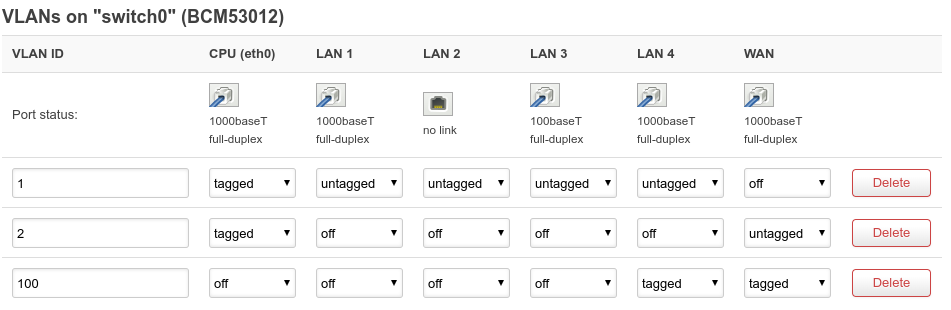

# Freebox in bridge mode with a Netgear R8000 running OpenWRT
Notes on Putting a Freebox Revolution in bridge mode with a Netgear R8000 running OpenWrt.

## Goals
* Install OpenWRT on the Netgear R8000
* Put the Freebox in bridge mode
* Full IPv6
* Separate guest network
* VPN server
* Bring back as many Freebox services as possible
    * Freebox Player (TV, DLNA client & co, Chromecast,...)
    * Freebox Server (TV over RTSP, DLNA server, other services announcements)

## Before we start
There will be a fair amount of customization, and due to how OpenWrt's upgrade process works:

* When modifying a configuration file, ensure that it will be kept during sysupgrade. Add it in `/etc/sysupgrade.conf` if needed.
* Keep track of installed packages, eg. this with a file directly on the router that will be retained during sysupgrade.
* Backup your configuration regularly.

## Installing OpenWrt
### Problem
Recent Netgear firmwares do not allow to downgrade below 1.0.4.12_10.1.46 nor reinstalling the same version:

```
$ hexdump -Cn80 R8000-V1.0.4.12_10.1.46.chk
                            ------>    1  0  4 12 10  1 46
00000000  2a 23 24 5e 00 00 00 3a  01 01 00 04 0c 0a 01 2e  |*#$^...:........|
00000010  d4 14 1a 81 00 00 00 00  01 de 60 00 00 00 00 00  |..........`.....|
00000020  d4 14 1a 81 fc 71 0a 4b  55 31 32 48 33 31 35 54  |.....q.KU12H315T|
00000030  30 30 5f 4e 45 54 47 45  41 52 48 44 52 30 00 60  |00_NETGEARHDR0.`|
00000040  de 01 99 45 54 b0 00 00  01 00 1c 00 00 00 64 4a  |...ET.........dJ|
00000050
```

```
$ hexdump -Cn80 openwrt-19.07.2-bcm53xx-netgear-r8000-squashfs.chk
                            ------>    1  1 99  0  0  0  0
00000000  2a 23 24 5e 00 00 00 3a  01 01 01 63 00 00 00 00  |*#$^...:...c....|
00000010  f7 af 87 42 00 00 00 00  00 78 00 00 00 00 00 00  |...B.....x......|
00000020  f7 af 87 42 26 3b 0b 77  55 31 32 48 33 31 35 54  |...B&;.wU12H315T|
00000030  30 30 5f 4e 45 54 47 45  41 52 48 44 52 30 00 00  |00_NETGEARHDR0..|
00000040  78 00 a7 e2 d0 ed 00 00  01 00 1c 00 00 00 00 00  |x...............|
00000050
```

### Solution: build an image with a very high version number
See [this github PR](https://github.com/openwrt/openwrt/pull/1857) (now merged)
```bash
git clone https://github.com/openwrt/openwrt.git
cd openwrt
git checkout v19.07.2
patch -p1 < ....
./scripts/feeds update -a
./scripts/feeds install -a
wget  https://downloads.openwrt.org/releases/19.07.2/targets/bcm53xx/generic/config.buildinfo -O .config
make menuconfig # Target system: `BCM47xx/53xx (ARM)`, Target profile: `Netgear R8000`
make
```
Then install the built image as usual.

### What doesn't work
#### Switch LEDs control
We can still control the other LEDs, but not the switch LEDs which blink on every packet. The LED kill switch on the
back side of the router doesn't work either.

*Workaround*: Duct tape
#### WPS
*Workaround*: None, and I don't care. Access to my precious Internets is worth typing a passphrase.

### What works
#### Wifi
But we must set the country code of AC radios to *US*.
#### Everything else

## General configuration
### Enable HTTPS
* Prepare PKI stuff
* Follow [official documentation](https://openwrt.org/docs/guide-user/luci/luci.secure)
* Comment out `listen_http` directives in `/etc/config/uhttpd`

### Remote logging
Send logs to a remote `rsyslog`, for proper reporting with logwatch

#### OpenWrt configuration
In `/etc/config/system` set remote IP, port and protocol and reload the `log` service:
```
config system
        ...
        option log_proto 'udp'
        option log_ip '192.168.39.253'
        option log_port '514'
        ...
```
#### Remote `rsyslog` configuration
```
...

$ModLoad imudp.so
$InputUDPServerBindRuleset remote
$UDPServerRun 514

$RuleSet local
<default rules go here>

$DefaultRuleset local

$template RemoteHost,"/var/log/hosts/%HOSTNAME%/syslog"
$RuleSet remote
*.* ?RemoteHost
```

#### Remote `logrotate` configuration
```
/var/log/hosts/<router hostname>/syslog
{
        rotate 7
        daily
        missingok
        notifempty
        delaycompress
        compress
        postrotate
                /usr/lib/rsyslog/rsyslog-rotate
        endscript
}
```

#### Remote `logwatch` configuration
* See [logwatch folder](logwatch) for config (custom services & co.). Works on my machine (Debian Buster)
* Cronjob: `/usr/sbin/logwatch --output mail --hostformat splitmail`


### DHCP
* Set a 10min lease time for all managed local interfaces
* Set `option ra_useleasetime '1'` in `/etc/config/dhcp` on all managed local interfaces to avoid infinite DHCPv6 lease time for static leases (well, leases are technically still infinite, but the observed *renew* and *rebind* are 5min and 8min which is OK):
```
config dhcp '...'
        ...
        option ra_useleasetime '1'
        ...
```

## Networking


### Conventions
| Name                    | Description                                                                         |
|-------------------------|-------------------------------------------------------------------------------------|
| `LOCAL_DN`              | Local domain name. May be an FQDN if you have one.                                  |
|                         |                                                                                     |
| `IP6_LLOCAL_FBX`        | The The Freebox Server link-local address, available in *Configuration IPv6*.       |
| `IP6_LLOCAL_ROUTER_WAN` | The OpenWrt router link-local address, WAN-side. Should be `eth0.2`.                |
| | |
| `IP6_PREFIX_FBX_0`      | The first public `/64` prefix delegated by the Freebox. We cannot use it for delegation as the Freebox server assigns itself the `::1` address. We'll pick addresses for the router itself in this block instead. |
| `IP6_PREFIX_FBX_LAN`    | The public `/64` prefix delegated by the Freebox we'll use for the *LAN* network.   |
| `IP6_PREFIX_FBX_VPN`    | The public `/64` prefix delegated by the Freebox we'll use for the *VPN* network.   |
| `IP6_PREFIX_FBX_GUEST`  | The public `/64` prefix delegated by the Freebox we'll use for the *GUEST* network. |
|                         |                                                                                     |
| `IP6_ULA_PREFIX`        | The local `/48` prefix.                                                             |
| `IP6_ULA_HINT_LAN`      | The IPv6 sub prefix we'll use for the *LAN* network. The *LAN* IPv6 block will be `<IP6_ULA_PREFIX>:<IP6_ULA_HINT_LAN>::/64`.|
| `IP6_ULA_HINT_GUEST`    | The IPv6 sub prefix we'll use for the *GUEST* network.                              |
|                         |                                                                                     |
| `IP4_GW_LAN`            | The IPv4 gateway for the *LAN* network.                                             |
| `IP4_NETMASK_LAN`       | The IPv4 netmask used for the *LAN* network, eg. `255.255.255.0`.                   |
| `IP4_NET_LAN`           | The IPv4 netmask used for the *LAN* network, eg. `192.168.42.0 255.255.255.0`.     |
| `IP4_GW_VPN`            | The IPv4 gateway for the *VPN* network.                                             |
| `IP4_GW_VPN_PTP`        | The "point to point address" of the *VPN* network IPv4 gateway.                     |
| `IP4_NET_VPN`           | The IPv4 netmask used for the *VPN* network, eg. `192.168.42.0 255.255.255.0`.     |
| `IP4_GW_GUEST`          | The IPv4 gateway for the *GUEST* network.                                           |
| `IP4_NETMASK_GUEST`     | The IPv4 netmask used for the *GUEST* network, eg. `255.255.255.0`.                 |
|                         |                                                                                     |
| `IP6_SUFFIX_GW_LAN`     | The IPv6 suffix we'll assign to the *LAN* network gateway, eg. `::1234`.            |
| `IP6_SUFFIX_GW_VPN`     | The IPv6 suffix we'll assign to the *VPN* network gateway.                          |
| `IP6_SUFFIX_GW_VPN_PTP` | The "point to point" IPv6 suffix we'll assign to the *VPN* network gateway.         |
| `IP6_SUFFIX_GW_GUEST`   | The IPv6 suffix we'll assign to the *VPN* network gateway.                          |
|                         |                                                                                     |
| `IP4_ROUTER`            | The public IPv4 for our router (assigned via DHCP).                                 |
| `IP6_ROUTER`            | The public IPv6 for our router, picked from `<IP6_PREFIX_FBX_0>`.                   |
| `IP6_ROUTER_LAN`        | An additional public IPv6 for our router, picked from `<IP6_PREFIX_FBX_0>`. Shouldn't be needed, but OpenWrt requires an address for all "interfaces" |
| `IP6_ROUTER_VPN`        | An additional public IPv6 for our router, picked from `<IP6_PREFIX_FBX_0>`.         |
| `IP6_ROUTER_GUEST`      | An additional public IPv6 for our router, picked from `<IP6_PREFIX_FBX_0>`.         |

### Freebox Player Configuration
* Go to *Réglages* > *Système* > *Réseau*
* Enable *Client DHCP en mode bridge*

### Freebox Server Configuration
* Set *Mode Réseau* to *Bridge*
* In *Configuration IPv6*, set *Next Hop* of chosen prefixes to `<IP6_LLOCAL_ROUTER_WAN>`.

### LAN Network
#### Configure the `wan6` interface
* Static IPv6 addresses
* IPv6 addresses
* Disable IPv6 assignment length
* Set IPv6 gateway
* Set IPv6 routed prefix

It should look like this in `/etc/config/network`:
```
config interface 'wan6'
        option ifname 'eth0.2'
        option proto 'static'
        option ip6gw '<IP6_LLOCAL_FBX>'
        option ip6prefix '<IP6_PREFIX_FBX_LAN>/64'
        list ip6addr '<IP6_ROUTER>'
        list ip6addr '<IP6_ROUTER_LAN>'
```
#### Configure SSID(s)
* Create them
* Assign them to the `lan` network

#### Configure the `lan` interface
* Static address
* Set IPv4 and netmask
* Set IPv6 assignment length, assignment hint, and suffix
* Set IPv6 prefixes to use (`ip6class`, cannot be done through UI)
  * `local`: use a /64 from our ULA prefix
  * `wan6`: use the delegated prefix assigned to `wan6`

It should look like this in `/etc/config/network`:
```
config interface 'lan'
        option type 'bridge'
        option ifname 'eth0.1'
        option proto 'static'
        option netmask '<IP4_NETMASK_LAN>'
        option ipaddr '<IP4_GW_LAN>'
        option ip6hint '<IP6_ULA_HINT_LAN>'
        list ip6class 'local'
        list ip6class 'wan6'
        option ip6assign '64'
        option ip6ifaceid '<IP6_SUFFIX_GW_LAN>'
```

### VPN Network
#### Install OpenVPN
```bash
opkg update
opkg install openvpn-openssl luci-app-openvpn
```

#### USB storage for moving parts (CRL,...)
To avoid wearing internal storage. Follow [official instructions](https://openwrt.org/docs/guide-user/storage/usb-drives-quickstart).

#### Create a `wan6vpn` interface
* Static IPv6 addresses
* IPv6 addresses
* Disable IPv6 assignment length
* Set IPv6 gateway
* Set IPv6 routed prefix
* Assign it to the `wan` firewall zone

It should look like this in `/etc/config/network`:
```
config interface 'wan6'
        option ifname 'eth0.2'
        option proto 'static'
        option ip6gw '<IP6_LLOCAL_FBX>'
        option ip6prefix '<IP6_PREFIX_FBX_VPN>/64'
        list ip6addr '<IP6_ROUTER_VPN>'
```
And in `/etc/config/firewall`:
```
config zone
        option name 'wan'
        option input 'REJECT'
        option output 'ACCEPT'
        option forward 'REJECT'
        option masq '1'
        option mtu_fix '1'
        option network 'wan wan6 wan6vpn'
```

#### OpenVPN Configuration
Done through OVPN file upload, to have full control. Prepare your PKI stuff and CRON job to retrieve the CRL before.

```
user nobody
group nogroup
script-security 2

verb 3

proto tcp6-server
port <VPNport>
keepalive 10 120
comp-lzo

dev tun
persist-tun
push tun-ipv6

mode server
tls-server
persist-key

ca /etc/openvpn/ca.crt
cert /etc/openvpn/server.crt
key /etc/openvpn/server.key
dh dh2048.pem
crl-verify /mnt/sda1/openvpn/crl.pem

ifconfig <IP4_GW_VPN> <IP4_GW_VPN_PTP>
ifconfig-pool <first IPv4 of the VPN net> <last IP of the VPN net> # 0 -> 250 if your GW is 254/253
route <IP4_NET_VPN>

ifconfig-ipv6 <IP6_GW_VPN> <IP6_GW_VPN_PTP>
ifconfig-ipv6-<IP6_PREFIX_FBX_VPN>::1/64  # important: ::0 is not usable
route-ipv6 <IP6_PREFIX_FBX_VPN>::/64

push "route <IP4_NET_VPN>"
push "route <IP4_NET_LAN>"
push "route-ipv6 <IP6_ULA_PREFIX>:<IP6_ULA_HINT_LAN>::/64"
push "route-ipv6 <IP6_PREFIX_FBX_LAN>::/64"
push "route-ipv6 <IP6_PREFIX_FBX_VPN>::/64"

push "dhcp-option <IP4_GW_LAN>"
push "dhcp-option DNS <IP6_ULA_PREFIX>:<IP6_ULA_HINT_LAN>::<IP6_SUFFIX_GW_LAN>"
push "dhcp-option DOMAIN <LOCAL_DN>"

ifconfig-pool-persist /mnt/sda1/openvpn/ipp.txt
```

#### Assign firewall zone
* Create a new `vpn` interface
    * Unmanaged
    * Interface: `tun0`
    * Firewall zone: `lan`

#### Allow access to DNS
By default, `dnsmasq` does not listen on unmanaged interfaces. Uncheck *Local Service Only* in *Network* >
*DHCP and DNS* > *General Settings*

#### Firewall
Allow inbound connections on the VPN port

#### Register a domain name for connected clients
Configure `dnsmasq` to monitor a folder for host files, and create a file in said directory upon client connection.

* Add `hostsdir=/mnt/sda1/openvpn/dnsmasq-hosts` to `/etc/dnsmasq.conf`
* Create `/mnt/sda1/openvpn/dnsmasq-hosts` and make it writeable by OpenVPN daemon
* Add `client-connect /etc/openvpn/client-connect.sh` to your OpenVPN configuration
* Create script:
```bash
#!/bin/sh

# create "hosts" file for newly connected client (<cert CN>.vpn -> <ip>)
domain="vpn.<LOCAL_DN>"

cat <<EOF > /mnt/sda1/openvpn/dnsmasq-hosts/"$common_name".hosts
$ifconfig_pool_remote_ip $common_name.$domain
$ifconfig_pool_remote_ip6 $common_name.$domain
EOF
exit 0
```

#### `stunnel` (with X509 client authentication)
To encapsulate OpenVPN traffic in an innocent-looking TLS connection on TCP/443, just in case of picky corporate
firewall.

* Adjust `/etc/config/uhttpd` to only listen in HTTPS only on internal interfaces
* Install it: `opkg install stunnel`
* Edit `/etc/config/stunnel` to use only standard config file:
```
config globals 'globals'
        option alt_config_file '/etc/stunnel/stunnel.conf'
        option setuid 'nobody'
        option setgid 'nogroup'
```
* Add configuration for IPv4 and IPv6 in `/etc/stunnel/stunnel.conf`:
```ini
[openvpn6]
client = no
accept = <IP6_ROUTER>:443
connect = localhost:<VPNport>
cert = /etc/openvpn/server.crt
key  = /etc/openvpn/server.key
CAfile = /etc/openvpn/ca.crt
CRLfile = /mnt/sda1/openvpn/crl.pem
verify = 2

[openvpn4]
client = no
accept = <IP4_ROUTER>:443
connect = localhost:<VPNport>
cert = /etc/openvpn/server.crt
key  = /etc/openvpn/server.key
CAfile = /etc/openvpn/ca.crt
CRLfile = /mnt/sda1/openvpn/crl.pem
verify = 2
```
* Allow incoming connections on TCP 443 (IPv4 and IPv6)

### Guest network
#### Create a `wan6guest` interface
* Static IPv6 addresses
* IPv6 addresses
* Disable IPv6 assignment length
* Set IPv6 gateway
* Set IPv6 routed prefix
* Assign it to the `wan` firewall zone

It should look like this in `/etc/config/network`:
```
config interface 'wan6'
        option ifname 'eth0.2'
        option proto 'static'
        option ip6gw '<IP6_LLOCAL_FBX>'
        option ip6prefix '<IP6_PREFIX_FBX_GUEST>/64'
        list ip6addr '<IP6_ROUTER_GUEST>'
```
And in `/etc/config/firewall`:
```
config zone
        option name 'wan'
        option input 'REJECT'
        option output 'ACCEPT'
        option forward 'REJECT'
        option masq '1'
        option mtu_fix '1'
        option network 'wan wan6 wan6vpn wan6guest'
```

#### Create SSID
* Same as usual
* Assign it to a new `guest` network

#### Configure the `guest` interface
* Static address
* Set IPv4 and netmask
* Set IPv6 assignment length, assignment hint, and suffix
* Set IPv6 prefixes to use (`ip6class`, cannot be done through UI)
  * `local`: use a /64 from our ULA prefix
  * `wan6guest`: use the delegated prefix assigned to `wan6guest`
* Assign it to a new `guest` firewall zone

It should look like this in `/etc/config/network`:
```
config interface 'guest'
        option proto 'static' 
        option netmask '<IP4_NETMASK_GUEST>'
        option ipaddr '<IP4_GW_GUEST>'
        option ip6hint '<IP6_ULA_HINT_GUEST>'
        list ip6class 'local'
        list ip6class 'wan6guest'
        option ip6assign '64'
        option ip6ifaceid '<IP6_SUFFIX_GW_GUEST>'
```
And in `/etc/config/firewall`:
```
config zone
        option name 'guest'
        option network 'guest'
        ...
```

#### Firewall
* Configure `guest` zone settings
  * Input: reject
  * Output: accept
  * Forward: reject
  * Covered networks: `guest`
  * Allow forward to destination zones: `wan`
* Add rules to allow DHCP, DHCPv6 and DNS and reject traffic to Freebox Server:


## Bringing back Frebox services
### Freebox Player
The player must be inside the local network to "see" other devices (DLNA, ...), while still communicating with the Freebox Server. It does so using the *tagged* VLAN 100. We just need to configure the switch:
* Plug the Freebox Player to a LAN switch port
* Enable tagged VLAN 100 on WAN port and the Freebox Player's port:


### Multiposte [playlist](http://mafreebox.freebox.fr/freeboxtv/playlist.m3u)
TV is streamed using the RTSP protocol, which negotiates (over UDP) a source and destination UDP port for video data.
This is:
* Not firewall friendly
* Not NAT friendly

However, there is a conntrack helper kernel module just for this:
* Install it: `opkg install kmod-ipt-nathelper-rtsp`
* Enable it in `sysctl.conf`
```bash
cat <<EOF >> /etc/sysctl.conf
#enable NF contrack for Freebox RTSP
net.netfilter.nf_conntrack_helper=1
EOF
```
* Reload: `sysctl -p`

### Freebox Server services announcements (DLNA, SMB share,...)
TODO

Ideas:
* `smcroute` (general multicast repeater)
* `mdns-repeater` (mDNS repeater)
* `conntrackd` (userspace conntrack helper, for DLNA/SSDP)
* `samba` (`remote announce` option)

## Misc
### NAT6
I need this for my certificates' CRLDP, so that it is accessible over IPv4 and IPv6: the certificates' CRLDP point to
the router, and incoming requests are then forwarded to the internal machine.

IPv4 port forwards can be easily configured through the interface, but for IPv6 we need a kernel module and custom
rules:
* Install it: `opkg install kmod-ipt-nat6`
* Custom firewall rules:
```bash
ip6tables -t nat -I PREROUTING -i eth0.2 -p tcp --dport 80 -j DNAT --to-destination [<local IPv6>]:80
ip6tables -A FORWARD -i eth0.2 -p tcp --dport 80 -j ACCEPT
```
